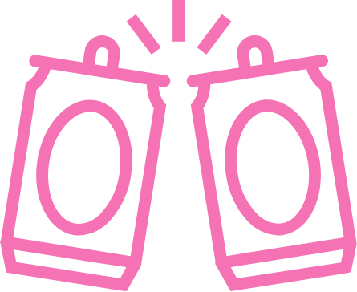

 
<h1>
    SHOUTS
</h1>

## Welcome to SHOUTS
Have you ever been drinking with your pals and thought, "Well how do you do, this certainly is a splendid tasting brew! I sure would like to wet my palate with this again." But then proceeded to sample a few many cold ones that they all became a blur? Having experienced a similar situation, SHOUTS is here so that never happens again. Add, rate and share your bevvies, so you can enjoy your favourites and will never again have to suffer through a bevvie a previous you forgot you disliked.

It's your shout!

## Local Set Up

1. Clone repo
2. `npm install && composer install`
3. Copy env.example to .env
4. `php artisan key:generate`
5. Add sqlite database at database/database.sqlite
6. `php artisan migrate`
7. Create photo folders at storage/app/public/sours & storage/app/public/users (*add zzzzempty-sour-glass.png to sours)
8. `php artisan storage:link`
